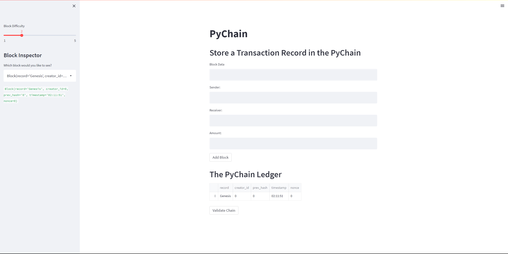

# Week 18 Homework Pychain by Alex Liu

This is what the initial interface looks like

 
This is what it looks like after adding a block. The information is hashed and stored. There is also a function to validate whether the blocks are actually supposed to be there. 